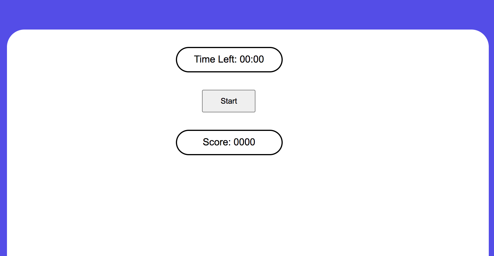

## Trivia Self Scoring Project 1

## Project Description

I am a huge fan of Who Wants to Be a Millionaire and Marvel, Legends, Harry Potter, Twilight, Lion King, and Star Wars movies. I would like to call it Family Nite Trivia for this game will be fun for kids and adults. The player is given a choice but they will not know what they have chosen until they click on one of the six boxes. The player after clicking and after confirmation is taken to the next screen where the game is set.

A set of 10 questions are asked and after that, the user can either collect their final score or go back to the main page to choose another set of questions. The scores will keep on adding up until the user does not terminate this game.

## Wireframe

## User Stories

- As a player, I would like to have choice in the topic.
- As a player, I would not like to have repeated questions.
- As a player, I would like the questions to be randomnized. 
- As a player, I would like to get the right answer.
- As a player, I would like bonus material. 
- As a player, I would like to see my incrementing score.
- As a player, I would like the score to reset when a new game starts 
- As a player, I would like the background to change in every level. 
- As a player, I would like some music. 
- As a player, I would like the screen to reset to the home page. 

## MVP Goals

- Show the 6 grid for the player to choose from
- Display the topic for the box clicked
- Start a series of question based on the topic clicked
- Scores should be updated after every click.
- Display the reset button on every screen
- if the player loses, the score is reset to 0

## Stretch Goals

- Share scores on social media.
- After all the 6 boxes clicked and all questions answered, two bonus rounds will open.
- Each screen will have different backgrounds based on the movie.
- Have a timer for count down.
- If the player wins - have a winning message
- if the player loses - have a come back again message.
- Display the final screen with the final score.
- Display the trophy - Bronze, Gold or Silver
- Display three options for help for the player. The player can choose only one option per topic.

## What could I achieve from my MVP goals:
1. Create multiple boxes for different categories. 
2. Have pictures in the boxes based on the movie category
3. Create the game screen where the questions appear with 4 different choices. 
4. Upon choosing the right answer, the button changes to green 
5. Upon choosing the wrong answer, the button changes to red.
6. Score is being updated.

## What I could not achieve 
1. I could not start working on the timer. 
2. I could not finish the winner message. 
3. I could not finish adding music 
4. The reset button is not having the full functionality yet. 
5. I need to update the other cards. 

## Screenshots 

## My Take on this project

Creating this project for the first time was hard. I spent one day living in the fear that I will not be able to do it. I went back to revisit some of the topcis and covered many videos regarding each topic. I later realized it was pure fear. I should have jumped into the project. Note to self: don't wait for enlightment. I plan to finish this project. 